# HHDMS — Full System Flowchart

> Generated from SRS document (`Home Healthcare System.docx.pdf`).
> All 15 modules, all actors, end-to-end data flow.
> Rendered with [Mermaid](https://mermaid.js.org/).

---

## 1. High-Level System Context

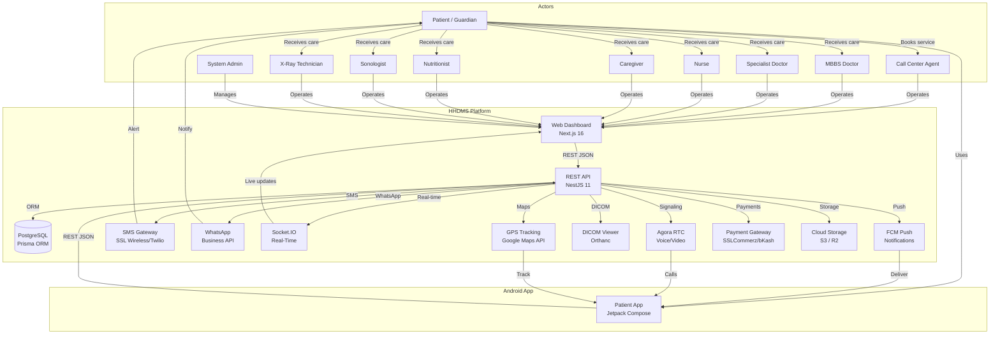

---

## 2. End-to-End Patient Journey

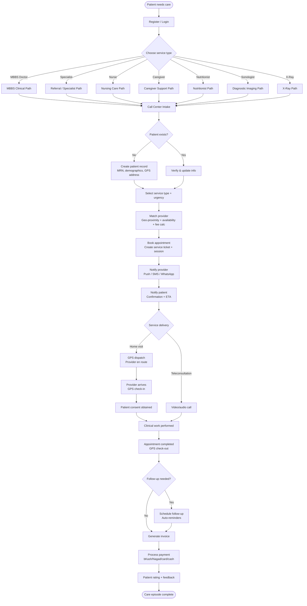

---

## 3. Call Center Module (CC) — Detailed Flow

```mermaid
flowchart TD
    INCOMING([Incoming call / web request]) --> CC_DASH[Call Center Dashboard]
    CC_DASH --> CC_IDENTIFY{Identify caller}
    CC_IDENTIFY -->|Phone match| CC_PULL[Pull patient record]
    CC_IDENTIFY -->|New caller| CC_REGISTER[Register patient<br/>Name, phone, address, NID, emergency contact]
    CC_PULL --> CC_NEED{Assess need}
    CC_REGISTER --> CC_NEED

    CC_NEED --> CC_TRIAGE[Quick triage questionnaire]
    CC_TRIAGE --> CC_SERVICES{Select service(s)}
    CC_SERVICES -->|Medical| CC_MBBS[MBBS Doctor]
    CC_SERVICES -->|Specialist| CC_SP[Specialist<br/>Pick from 11 categories]
    CC_SERVICES -->|Nursing| CC_NS[Adult / Pediatric Nurse]
    CC_SERVICES -->|Caregiver| CC_CG[Caregiver<br/>Male/Female/Child + duration]
    CC_SERVICES -->|Diet| CC_NU[Nutritionist]
    CC_SERVICES -->|Imaging| CC_US[Sonologist]
    CC_SERVICES -->|X-Ray| CC_XR[X-Ray Technician]
    CC_SERVICES -->|Multiple| CC_MULTI[Multi-service bundle]

    CC_MBBS & CC_SP & CC_NS & CC_CG & CC_NU & CC_US & CC_XR & CC_MULTI --> CC_CHECK[Check availability<br/>Geo-filter + calendar]
    CC_CHECK --> CC_AVAIL{Available?}
    CC_AVAIL -->|Yes| CC_FEE[Display fee estimate]
    CC_AVAIL -->|No| CC_ALT[Suggest alternatives<br/>Different time / provider]
    CC_FEE --> CC_CONFIRM[Confirm booking<br/>Create service_ticket + booking_session]
    CC_CONFIRM --> CC_ASSIGN[Auto-assign provider<br/>Least-loaded + geo-proximity]
    CC_ASSIGN --> CC_NOTIFY[Notify all parties<br/>SMS + WhatsApp + Push]
    CC_NOTIFY --> CC_TICKET[Open ticket in queue]
    CC_TICKET --> CC_TRACK[Track via dashboard<br/>Live status updates]
```

---

## 4. MBBS Doctor Module (MB) — Clinical Workflow

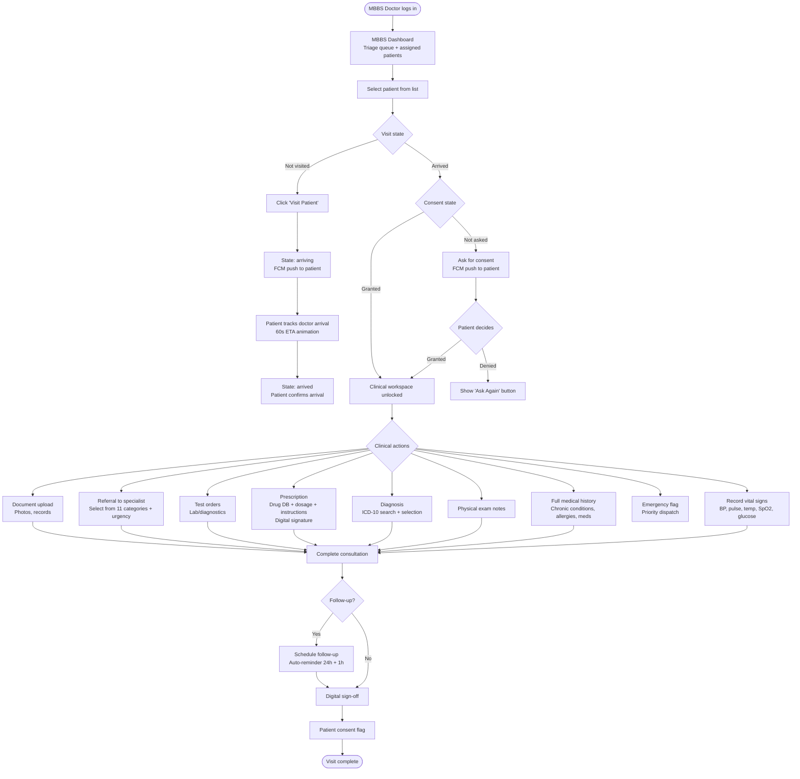

---

## 5. Referral & Specialist Module (SP) — Chain Flow

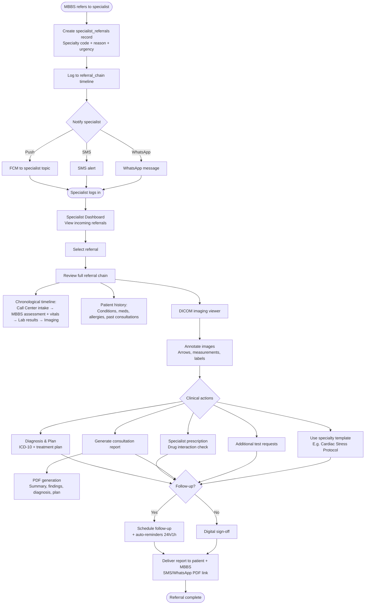

---

## 6. Nurse Module (NS) — Clinical Workflow

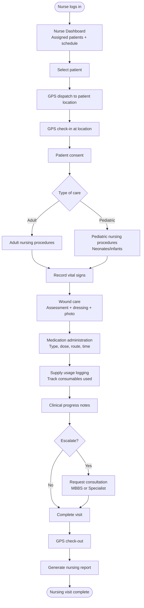

---

## 7. Caregiver Module (CG) — Support Workflow

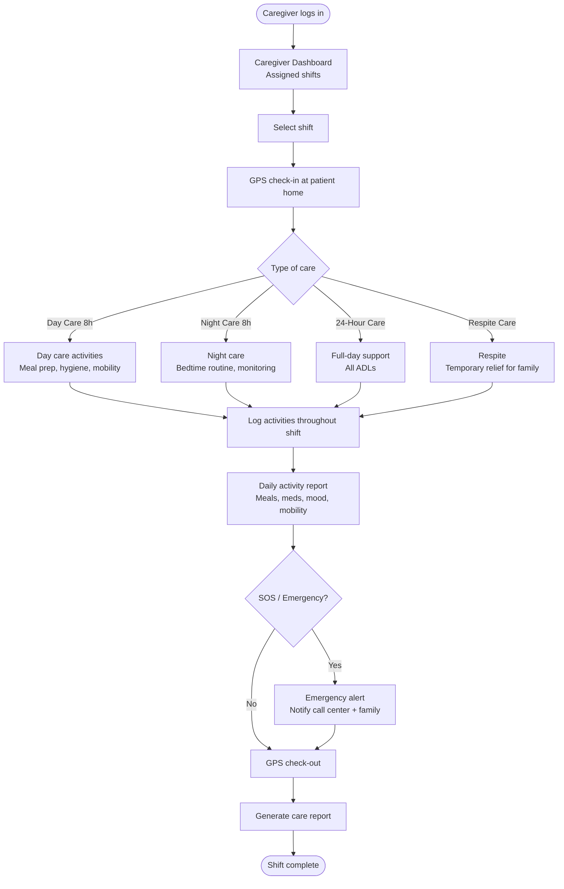

---

## 8. Nutritionist Module (NU) — Diet Planning Workflow

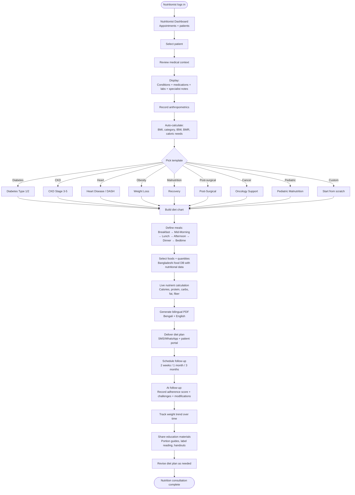

---

## 9. Sonologist Module (US) — Imaging Workflow

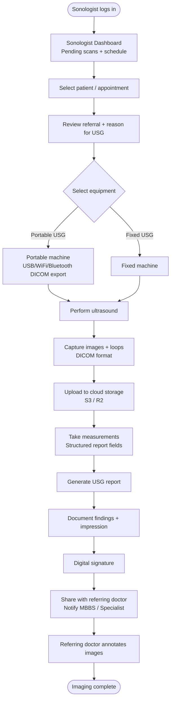

---

## 10. X-Ray Technician Module (XR) — Workflow

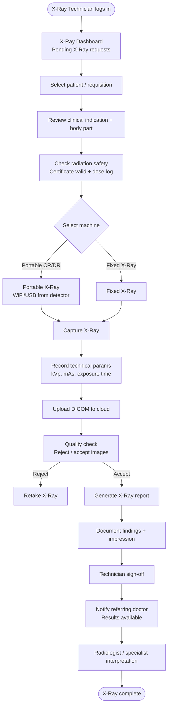

---

## 11. Billing & Payments Module (BP) — Financial Flow

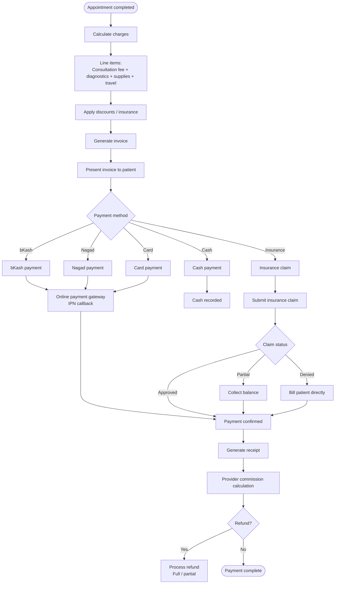

---

## 12. Notification Engine (NT) — Multi-Channel Delivery

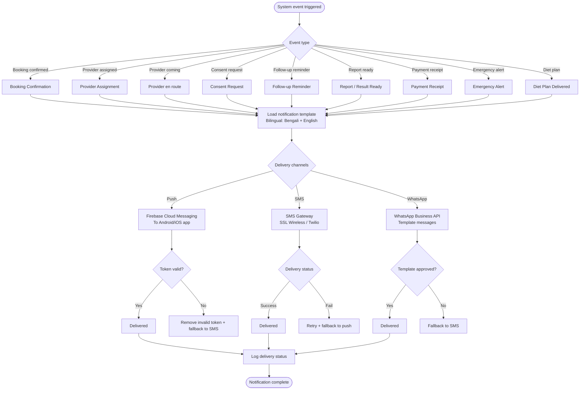

---

## 13. GPS & Live Tracking Module (LT) — Location Flow

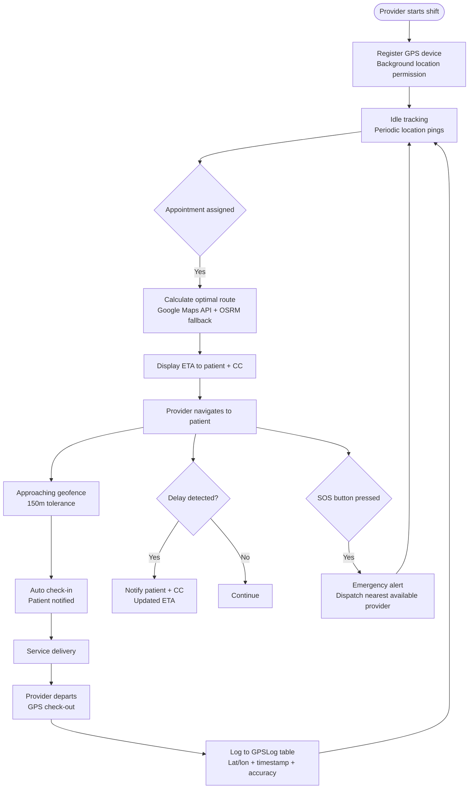

---

## 14. Scheduling & Dispatch Module (SD) — Calendar Flow

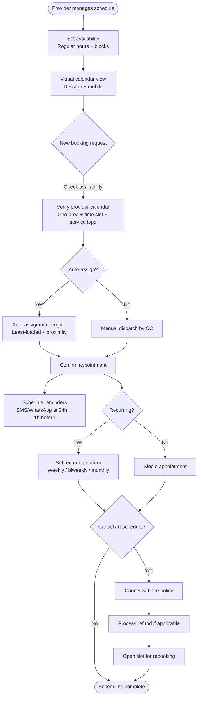

---

## 15. Admin Module (AD) — Management Flow

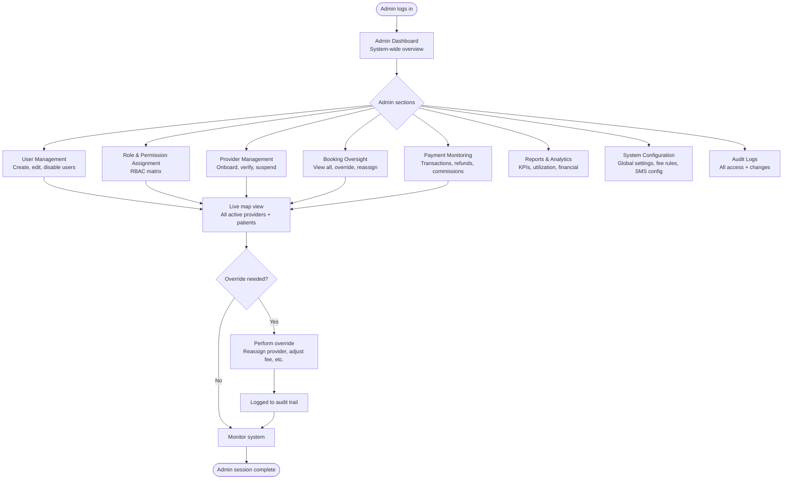

---

## 16. Data Flow Summary

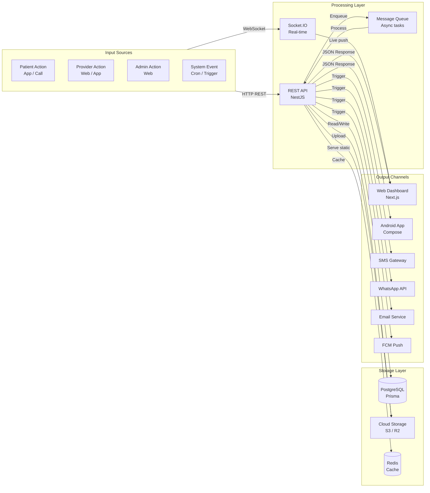

---

## 17. Module Dependency Graph

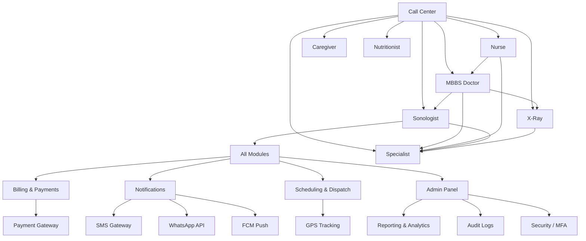

---

## 18. Screen / Route Map (Android + Web)

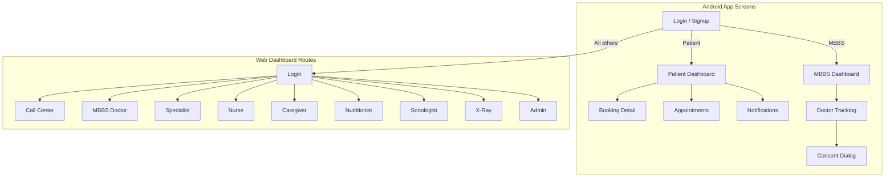

---

## Legend

| Symbol | Meaning |
|--------|---------|
| `([Text])` | Start / End point |
| `[Text]` | Process / Action |
| `{Text}` | Decision / Branch |
| `([External])` | External system |
| `>` | Data flow direction |
| `---` | Dependency (module graph) |
